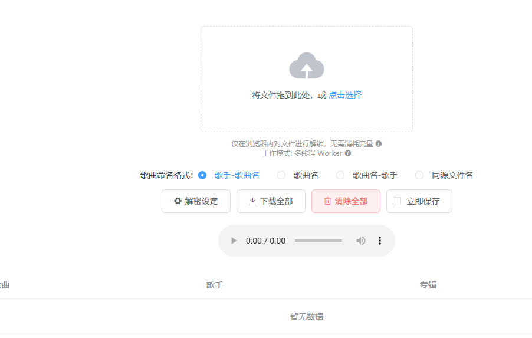
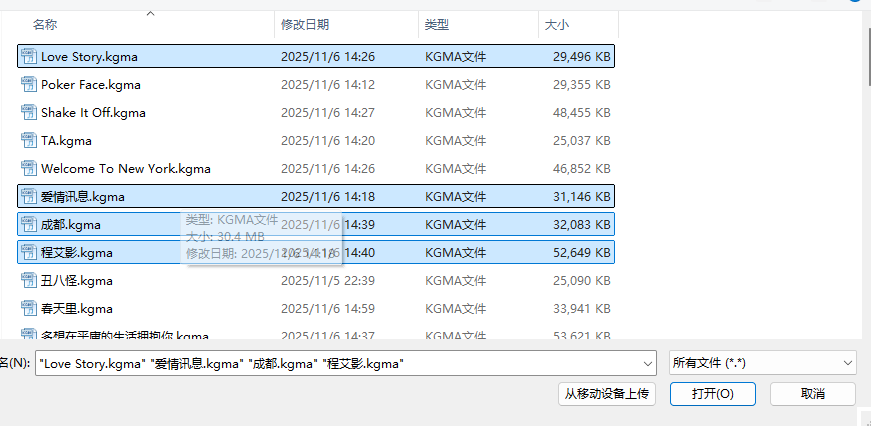
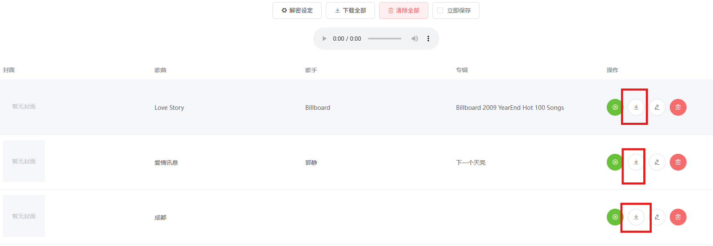
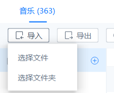

转换酷狗音乐的加密格式.kgma，为通用音乐格式.flac

* content
{:toc}

最近发现酷狗音乐会员下载音乐后的格式是.kgma，那么我想要在我的美区id苹果手机上听离线歌曲，apple music 仅仅支持.flac，那么我就在研究怎么转换格式为.flac呢？

## Step 1:下载音乐
首先，需要先下载音乐到本地，酷狗音乐需要开通*超级VIP会员*才能下载音乐，一个月是送上300首歌曲的下载权限。
## Step 2:转换音乐
打开这个网址，[音乐转换](http://unlock.music.hi.cn/)，
点击图中*上传文件区域*，
然后进入选择文件的窗口，按住ctrl，鼠标单击可以一次性添加多个文件，之后点击 “_打开_”
点击图片的⬇️按钮，

到这里，就已经完成  **转换格式**的需求啦，那么如果你跟我一样，需要导入本地音乐文件到 iphone 手机，还请往下看

## Step 3:导入音乐到 apple music
需要先去下载一个[爱思助手](https://www.i4.cn/pro_pc.html),之后利用USB-Type-C 或 双向Type-C 线连接电脑，连接成功后，点击这里的“音乐”，
我一般点击“_选择文件夹_”这样可以直接把所有的符合格式的文件导入到手机，
这样就大功告成啦

